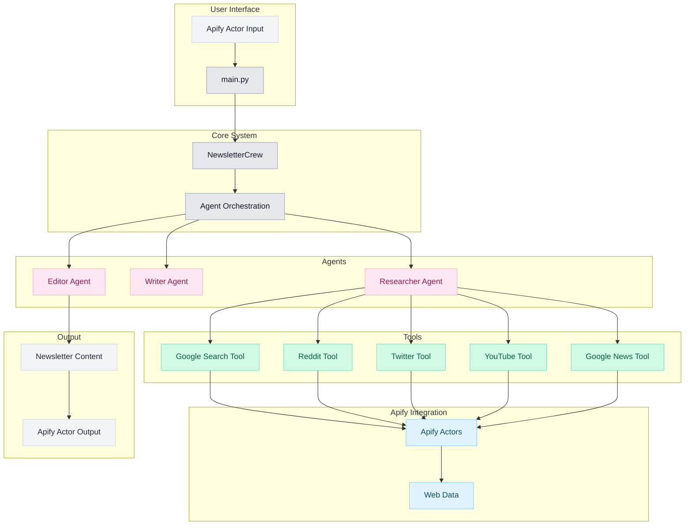

# Newsletter AI Agent

An AI-powered Apify actor that generates well-structured newsletters using a crew of specialized AI agents. The system uses CrewAI to coordinate multiple agents that research, write, and edit newsletter content based on user input.

## Documentation
[](https://newsletter-ai-agent.pratikdani.com/)

## Features

- **Multi-agent System**: Uses CrewAI to coordinate specialized agents for research, writing, and editing
- **Apify Integration**: Leverages Apify actors for efficient web scraping and data collection
- **Comprehensive Research**: Gathers information from multiple sources:
  - Google Search results
  - Latest news articles
  - Reddit discussions
  - Twitter/X posts
  - YouTube videos
- **Intelligent Processing**: Transforms raw data into well-structured newsletters
- **Markdown Output**: Delivers clean, formatted content ready for distribution
- **Configurable Sections**: Customize newsletter structure and content focus

## Architecture



## Prerequisites

- Python 3.10+
- Apify API key
- Google API key for Gemini Pro
- Apify CLI (for local development)

## Environment Setup

1. Clone the repository:
```bash
git clone [repository-url]
cd newsletter-agent
```

2. Install Apify CLI:
```bash
npm install -g apify-cli
```

3. Create and activate virtual environment:
```bash
python -m venv venv
source venv/bin/activate  # On Windows, use `venv\Scripts\activate`
```

4. Install dependencies:
```bash
pip install -r requirements.txt
```

5. Configure environment variables in `.env`:
```bash
APIFY_API_KEY=your_apify_api_key_here
GOOGLE_API_KEY=your_google_api_key_here
```

## Usage

### Local Development

1. Run the actor locally:
```bash
apify run
```

2. Test with custom input by modifying `storage/key_value_stores/default/INPUT.json`:
```json
{
    "topic": "Your newsletter topic here"
}
```

### Apify Platform Deployment

1. Login to Apify:
```bash
apify login
```

2. Deploy the actor:
```bash
apify push
```

## Input Schema

```json
{
    "topic": {
        "title": "Newsletter Topic",
        "type": "string",
        "description": "Topic or requirements for the newsletter",
        "editor": "textfield"
    }
}
```

Example input:
```json
{
    "topic": "Latest developments in quantum computing, focusing on breakthroughs, industry news, and practical applications"
}
```

## Output Format

The actor outputs a dataset containing:

```json
{
    "topic": "string",
    "content": "markdown formatted newsletter content",
    "status": "success|error",
    "timestamp": "ISO 8601 datetime"
}
```

## Project Structure

```
newsletter-agent/
├── .actor/                # Actor configuration
├── docs/                  # Documentation
├── src/
│   ├── agents/           # AI agent implementations
│   │   ├── researcher.py # Research agent
│   │   ├── writer.py     # Content writer
│   │   └── editor.py     # Editor
│   ├── config/           # Configuration
│   ├── tools/            # Apify integration tools
│   ├── newsletter_crew.py # Agent orchestration
│   └── main.py          # Entry point
├── tests/                # Test suite
├── requirements.txt      # Python dependencies
└── README.md
```

## Contributing

1. Fork the repository
2. Create your feature branch (`git checkout -b feature/amazing-feature`)
3. Commit your changes (`git commit -m 'Add amazing feature'`)
4. Push to the branch (`git push origin feature/amazing-feature`)
5. Open a Pull Request

## License

This project is licensed under the MIT License - see the [LICENSE](LICENSE) file for details.
