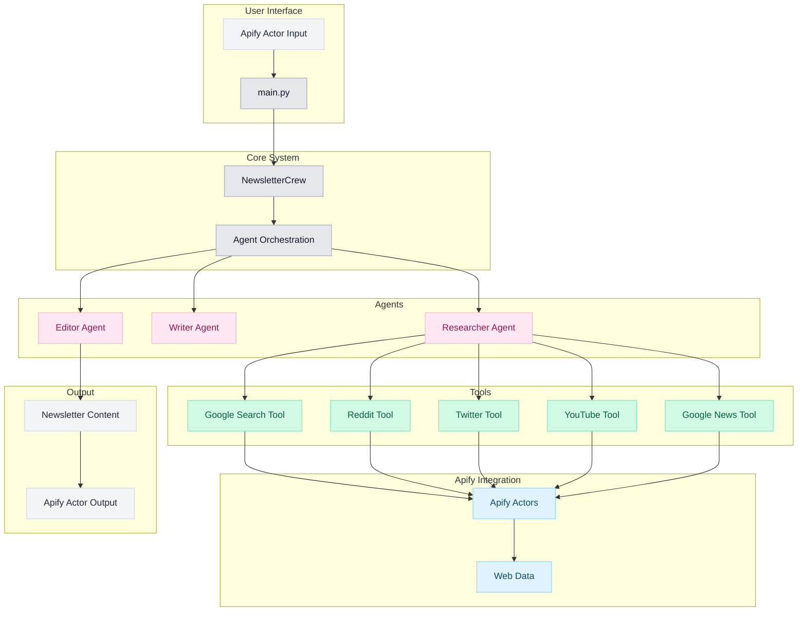

# Newsletter AI Agent

The Newsletter AI Agent is a powerful tool designed to automatically generate newsletters about specific topics. It leverages CrewAI to orchestrate a team of specialized AI agents that work together to gather relevant information, organize it, and create a well-structured newsletter ready for distribution.

## Overview

This agent helps you stay informed about your areas of interest by:

1. Collecting the latest information on your specified topics
2. Organizing the content in a readable format
3. Generating a complete newsletter ready for distribution

## Key Features

- **Topic-based content gathering**: Specify your interests and let the agent find relevant information
- **Automated newsletter generation**: Transform raw information into well-structured newsletters
- **Customizable outputs**: Adjust the format and style of your newsletters
- **Agent-based architecture**: Leverages CrewAI to coordinate specialized agents for research, writing, and editing

## Codebase Architecture

The Newsletter AI Agent is built as an Apify Actor with a multi-agent system powered by CrewAI. Below is a diagram of the codebase architecture:

### Key Components

1. **Entry Point**: `main.py` serves as the entry point for the Apify Actor, handling input and initializing the system.

2. **Newsletter Crew**: The `NewsletterCrew` class orchestrates the agents and manages the workflow.

3. **Agents**:
   - `ResearcherAgent`: Gathers information using various tools
   - `WriterAgent`: Transforms research into newsletter content
   - `EditorAgent`: Reviews and improves the final output

4. **Tools**: Each tool is implemented as a CrewAI `BaseTool` that interacts with Apify actors:
   - `GoogleSearchTool`: Searches the web using Apify's Google Search Scraper
   - `RedditTool`: Gathers discussions using a Reddit scraper
   - `TwitterTool`: Collects tweets using Twitter Scraper Lite
   - `YouTubeTool`: Finds videos using a YouTube scraper
   - `GoogleNewsTool`: Gathers news using Google News Scraper

5. **Apify Integration**: The `RunApifyActor` base class provides a standardized way to call Apify actors and process their results.

## CrewAI Implementation

The Newsletter AI Agent uses [CrewAI](https://docs.crewai.com), a framework for orchestrating role-playing AI agents. Our implementation includes:

- **Researcher Agent**: Gathers comprehensive information about the specified topic from various sources
- **Writer Agent**: Transforms research data into engaging newsletter content
- **Editor Agent**: Reviews, improves, and finalizes the newsletter for publication

These agents work together in a sequential process, with each agent building upon the work of the previous one to create a high-quality newsletter.

## Custom Tools

The agents use custom tools to interact with external data sources:

- **Google Search Tool**: Searches the web for relevant information
- **Reddit Tool**: Gathers discussions from relevant subreddits
- **Twitter Tool**: Collects tweets related to the topic
- **YouTube Tool**: Finds relevant video content
- **Google News Tool**: Gathers the latest news articles

## Getting Started

Check out the [Getting Started](/getting-started) guide to begin using the Newsletter AI Agent.
